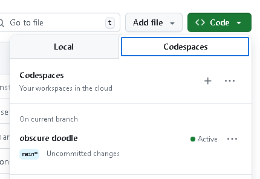
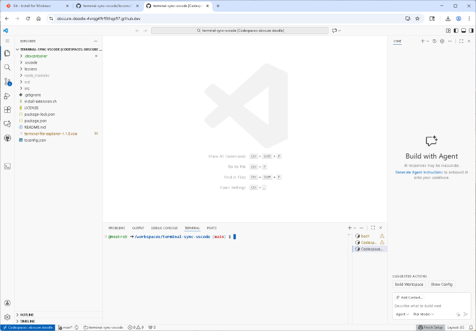

# Getting Started in the tutorial environment

## Github: register and find the repository

1. Make sure you have an account [on Github.com](https://docs.github.com/en/get-started/start-your-journey/creating-an-account-on-github#signing-up-for-a-new-personal-account). You will have to verify your email.
2. Next, navigate to this lesson repository: [codespace-shell-novice](https://github.com/dkbiocode/codespace-shell-novice) and find the green button that says <b><> Code</b>.

3. Click on that button for the pulldown box. If you are logged in, you will see a "CODESPACES" tab.
4. Find <b>obscure doodle</b> and click.

Once you click, it will take a minute or so to get started up, so sit back and watch!

## Launching the Codespace means launching VS Code!

As the codespace starts running, VS Code also initializes.

Here is a screenshot:

If you are not familiar with VS Code, see [VS-CODE-README.md](VS-CODE-README.md) to get oriented. If you are, you can skip ahead to the lessons.

## Github codespaces: launch the learning environment

The learning environment will be a lightweight cloud computing setting that will be the same for everyone, and most similar to a server you may encounter in HPC. We will use this setting for basic tutorials.
