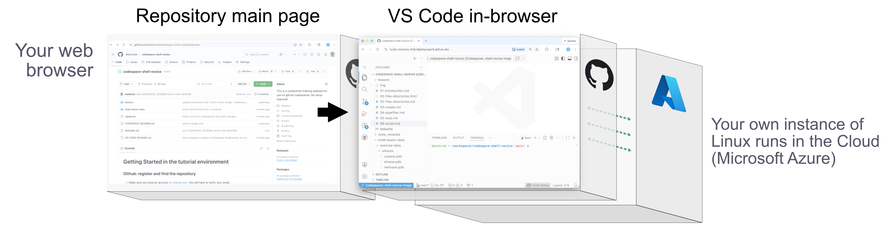
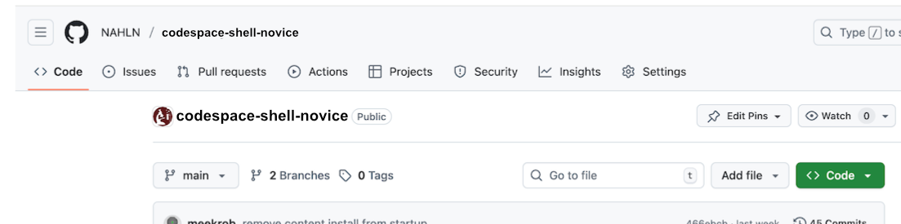
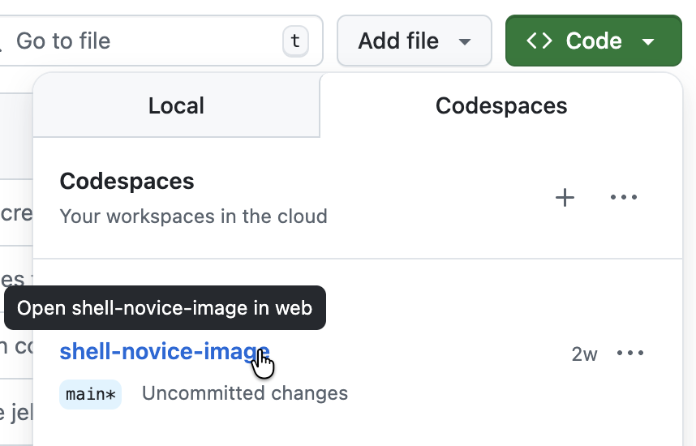
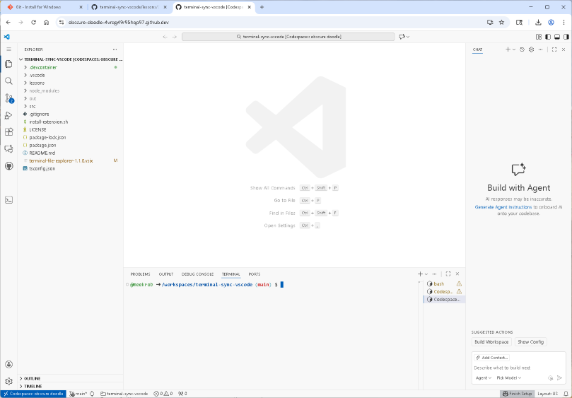

<!-- If you are in VS-Code, do Shift-Ctrl/Command-V to view rendered text and links -->
<!-- This will open an editor tab labeled "Preview 01-introduction.md"              -->
# Where to start

Use this document as a how-to on getting started with Github and Codespaces. 

Instructional material is in the "lessons" folder. See this [Table Of Contents](lessons/README.md) to begin.

# Using Codespaces for this Training

This repository runs a lightweight Linux server in The Cloud, using your web browser as an interface. You will use VS Code, which includes a terminal, file browser, editor, and other useful tools.

## Github: Sign up and find the repository

1. Make sure you have an account [on Github.com](https://docs.github.com/en/get-started/start-your-journey/creating-an-account-on-github#signing-up-for-a-new-personal-account). You will have to verify your email.
2. Next, navigate to this lesson repository: [codespace-shell-novice](https://github.com/dkbiocode/codespace-shell-novice) and find the green button that says <b><> Code</b>.

3. Click on that button for the pulldown box. If you are logged in, you will see a "Codespaces" tab.
4. Find <b>shell-novice-image</b> and click.

Once you click, it will take a minute or so to get started up, so sit back and watch!

<b>Note: you're using a free tier. So don't worry about "this codespace is paid for by..."</b>

## Launching the Codespace means launching VS Code!

As the codespace starts running, VS Code also initializes.

Here is a screenshot:

If you are not familiar with VS Code, see [VS-CODE-README.md](VS-CODE-README.md) to get oriented. If you are, you can skip ahead to the lessons.

