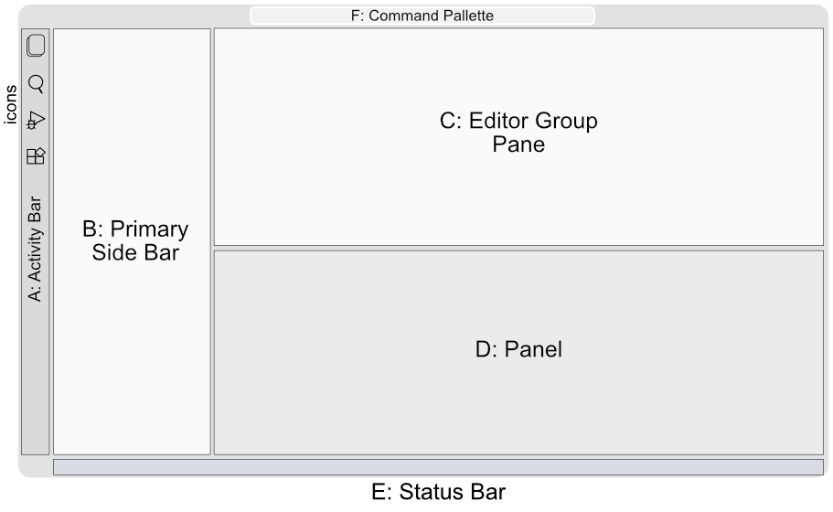

# VS Code: quick overview

VS Code (Visual Studio Code) is a free-to-use IDE (code editor with tools). The version we use will launch in the github window, so no installation required.

It is an Integrated Development Environment (IDE), and has several great tools integrated with the editor, such as a file browser, debugger, and importantly, **its own terminal!**

## VS Code window panes

See this [Get Started guide](https://code.visualstudio.com/docs/getstarted/userinterface) for videos and more information.

* **A. Activity Bar** - Located on the far left-hand side. Loads "views" (like the File Explorer) into the **Primary Side Bar**. Icons launch the different views.
* **B. Primary Side Bar** - Contains different views (like the File Explorer) to assist you while working on your project.
* **C. Editor Group Pane** - The main area to edit and view files. Can contain multiple tabs or split windows side-by-side.
* **D. Panel** - Additional "Views" with key controls like the **Terminal**.
* **E. Status Bar** - Information about the project, codespace and files.
* **F. Command Palette** - Certain functions can be run from here. This is more advanced.
