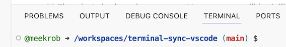
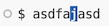

<a id="top"></a>

# 02-files-directories

**Command line Files and Directories (folders)**

The part of the operating system responsible for managing files and directories
is called the **file system**.
It organizes our data into files,
which hold information,
and directories (also called 'folders'),
which hold files or other directories.

Several commands are frequently used to create, inspect, rename, and delete files and directories.

## Table of Contents

- [Getting started](#getting-started)
  - [Slashes](#slashes)
  - [Clearing your terminal](#clearing-your-terminal)
- [Getting help](#getting-help)
  - [The `--help` option](#the-help-option)
- [Unsupported command-line options](#unsupported-command-line-options)
  - [The `man` command](#the-man-command)
  - [Exploring More `ls` Options](#exploring-more-ls-options)
    - [Challenge](#challenge)
    - [Solution](#solution)
  - [Listing in Reverse Chronological Order](#listing-in-reverse-chronological-order)
    - [Challenge](#challenge-1)
    - [Solution](#solution-1)
- [📌 Section Recap](#-section-recap)
- [Exploring Other Directories](#exploring-other-directories)
  - [Other Hidden Files](#other-hidden-files)
  - [Challenge: Absolute vs Relative Paths](#challenge-absolute-vs-relative-paths)
    - [Solution](#solution-2)
  - [Challenge: Relative Path Resolution](#challenge-relative-path-resolution)
    - [Solution](#solution-3)
  - [`ls` Reading Comprehension](#ls-reading-comprehension)
    - [Solution](#solution-4)
- [General Syntax of a Shell Command](#general-syntax-of-a-shell-command)
- [Nelle's Pipeline: Organizing Files](#nelles-pipeline-organizing-files)

---

### Getting started

To begin exploring file and directory commands, open the **TERMINAL** pane.

👀 It’s the bottom pane of your VS Code window, and looks like:



Make sure **TERMINAL** is underlined. You can click other tabs (PROBLEMS, OUTPUT, etc.), but return to **TERMINAL** before continuing.

👀 First, look at the **prompt**, which appears as:

~~~
@ghuser ➜ /workspaces/codespace-shell-novice (main) $ 
~~~

💡 NOTICE:  **"ghuser"** is your GitHub username (mine is <mark style="font-weight:bold; background-color: rgba(0, 0, 0, 0); color: #267B00">meekrob</mark>).  


> ⚙️ Let's make a few temporary changes to simplify the environment. Copy and paste the following into your terminal, then press <kbd>RETURN</kbd>:
> ~~~
> unalias ls
> PS1="$ "
> clear
> ~~~
>

👀 Your TERMINAL should now show only a dollar sign (`$`) at the top. This is static—you can’t delete it.


**Breakdown of your terminal prompt:**
1. The circle is a VS Code UI element — **ignore it**.
2. The `$` is the prompt marker. Your typing appears to its right.
3. The dark rectangle is the **cursor**, indicating where text will be inserted.

👉 Try it out.

1. Type a few characters (e.g., “asdfasdf”). You may need to click inside the terminal first.
2. Move the cursor with the arrow keys: <kbd>←</kbd> <kbd>→</kbd>.
3. Add more text at the cursor position.




👀  Notice how the dark square marks the insertion point. **This is different from apps like Microsoft Word**, which use a vertical bar that inserts *after* the cursor.

👉  Next: clear the gibberish using any of these methods:
* Press <kbd>→</kbd> until the cursor reaches the end, then delete everything back to the `$`.
* Press <kbd>CTRL</kbd>+<kbd>E</kbd> to jump to the end (a great shortcut!), then delete backward.
* Press <kbd>CTRL</kbd>+<kbd>C</kbd> to cancel the current line. A new, clean prompt will appear below.


Next, let's find out where we are by running a command called `pwd`
(which stands for 'print working directory'). Directories are like *places* — at any time
while we are using the shell, we are in exactly one place called
our **current working directory**. Commands mostly read and write files in the
current working directory, i.e. 'here', so knowing where you are before running
a command is important. `pwd` shows you where you are:

**Command:**

```
$ pwd
```

**Output:**

```
/workspaces/codespace-shell-novice/
```

Here, the computer's response is `/workspaces/codespace-shell-novice/`.  
This location is particular to GitHub Codespaces. We will refer to this as the **Codespace Starting Directory**.  On a normal server,
you will be in your **HOME** directory (discussed later).

At the top of the filesystem is the **root directory**, which holds everything else.  
It is written as a single slash `/`; this is the leading slash in  
`/workspaces/codespace-shell-novice/`.

Inside that directory are several other directories:
`bin` (which is where some built-in programs are stored),
`workspaces` (for this learning repository),
`home` (where users' personal directories are located),
`tmp` (for temporary files that don't need to be stored long-term),
and so on.

We know that our current working directory `/workspaces/codespace-shell-novice/` is stored inside `/workspaces`
because "/workspaces" is the first part of its name.
Similarly,
we know that `/workspaces` is stored inside the root directory `/`
because its name begins with `/`.

> ## Slashes
>
> Notice that there are two meanings for the `/` character.
> When it appears at the front of a file or directory name,
> it refers to the root directory. When it appears *inside* a path,
> it's just a separator.


Under `/workspaces`, we find directories and files used for different purposes.  
These make up the Codespace environment and include our lesson materials.

Now let's learn the command that will help us explore our local directory.  
We can see what's in our home directory by running `ls`:

Now let's learn the command that helps us explore our current directory.  
We can list its contents by running `ls`:

**Command:**

```
$ ls
```

**Output:**

```
install-extension.sh  LICENSE       out           package-lock.json  shell-lesson-data  terminal-file-explorer-1.1.0.vsix
lessons               node_modules  package.json  README.md          src                tsconfig.json
```

`ls` prints the names of the files and directories in the current directory.
We can make its output more comprehensible by using the `-F` **option**
which tells `ls` to classify the output
by adding a marker to file and directory names to indicate what they are:
- a trailing `/` indicates that this is a directory
- `@` indicates a link
- `*` indicates an executable

Depending on your shell's default settings,
the shell might also use colors to indicate whether each entry is a file or
directory.

**Command:**

~~~
$ ls -F
~~~

**Output:**

~~~
install-extension.sh  LICENSE        out/          package-lock.json  shell-lesson-data/  terminal-file-explorer-1.1.0.vsix
lessons/              node_modules/  package.json  README.md          src/                tsconfig.json
~~~


Here,
we can see that the our directory contains **sub-directories** when `ls -F` 
shows a trailing slash on the name (such as `out/`).
Any names in the output that don't have a classification symbol
are **files** in the current working directory.

## Clearing your terminal

If your screen gets too cluttered, you can clear your terminal using the
`clear` command. You can still access previous commands using <kbd>↑</kbd>
and <kbd>↓</kbd> to move line-by-line, or by scrolling in your terminal.


### Getting help

`ls` has lots of other **options**. There are two common ways to find out how
to use a command and what options it accepts:

1. We can pass a `--help` option to any command (available on Linux and Git Bash), for example:

**Command:**

~~~
$ ls --help
~~~
    

2. We can read its manual with `man` (available on Linux and macOS):

**Command:**

~~~
$ man ls
~~~
    

We'll describe both ways next.

#### The `--help` option

Most bash commands and programs that people have written to be
run from within bash, support a `--help` option that displays more
information on how to use the command or program.


**Command:**

~~~
$ ls --help
~~~

**Output (truncated):**

~~~
Usage: ls [OPTION]... [FILE]...
List information about the FILEs (the current directory by default).
Sort entries alphabetically if neither -cftuvSUX nor --sort is specified.

Mandatory arguments to long options are mandatory for short options, too.
  -a, --all                  do not ignore entries starting with .
  -A, --almost-all           do not list implied . and ..
      --author               with -l, print the author of each file
  -b, --escape               print C-style escapes for nongraphic characters
      --block-size=SIZE      scale sizes by SIZE before printing them; e.g.,
                               '--block-size=M' prints sizes in units of
                               1,048,576 bytes; see SIZE format below
  -B, --ignore-backups       do not list implied entries ending with ~
  -c                         with -lt: sort by, and show, ctime (time of last
                               modification of file status information);
...        ...        ...
~~~

## Unsupported command-line options

**Command:**

~~~
$ ls -j
~~~

**Output:**

~~~
ls: invalid option -- 'j'
Try 'ls --help' for more information.
~~~

#### The `man` command

The other way to learn about `ls` is to type:

**Command:**

~~~
$ man ls
~~~

**Output (interactive):**

This command produces a *different kind of output*: instead of printing text and returning to your prompt, it opens a **full-screen viewer**.
This viewer reacts to special shortcut keys and lets you scroll through the documentation.

Specifically, `man ls` turns your terminal into a page containing a description of the `ls` command and all its options.

To navigate through the `man` pages,
you may use <kbd>↑</kbd> and <kbd>↓</kbd> to move line-by-line,
or try <kbd>B</kbd> and <kbd>Spacebar</kbd> to skip up and down by a full page.
To search for a character or word in the `man` pages,
use <kbd>/</kbd> followed by the character or word you are searching for.
Sometimes a search will result in multiple hits.
If so, you can move between hits using <kbd>n</kbd> (for moving forward) and
<kbd>Shift</kbd>+<kbd>n</kbd> (for moving backward).

To navigate through the `man` pages:

- Use <kbd>↑</kbd> and <kbd>↓</kbd> to move line-by-line
- Use <kbd>b</kbd> and <kbd>Spacebar</kbd> to move up or down by a full page
- Use <kbd>/</kbd> followed by a word to **search**
- Use <kbd>n</kbd> and <kbd>Shift</kbd>+<kbd>n</kbd> to move between search results

To **quit** the `man` pages, press <kbd>q</kbd>.

> A third way to find command help is by searching the web.
> Adding the phrase `unix man page` to your search often leads directly to the documentation.
>
> GNU also provides links to its
> [manuals](http://www.gnu.org/manual/manual.html), including the
> [core GNU utilities](http://www.gnu.org/software/coreutils/manual/coreutils.html),
> which cover many commands in this lesson.

[back to top](#top)

---

## Exploring More `ls` Options
>
> ### Challenge
> You can also use two options at the same time. What does the command `ls` do when used
> with the `-l` option? What about if you use both the `-l` and the `-h` option?
>
> Some of its output is about properties that we do not cover in this lesson (such
> as file permissions and ownership), but the rest should be useful
> nevertheless.
>
> ### Solution
> The `-l` option makes `ls` use a **l**ong listing format, showing not only
> the file/directory names but also additional information, such as the file size
> and the time of its last modification. If you use both the `-h` option and the `-l` option,
> this makes the file size '**h**uman readable', i.e. displaying something like `5.3K`
> instead of `5369`.
> 

## Listing in Reverse Chronological Order
>
> ### Challenge
> By default, `ls` lists the contents of a directory in alphabetical
> order by name. The command `ls -t` lists items by time of last
> change instead of alphabetically. The command `ls -r` lists the
> contents of a directory in reverse order.
> Which file is displayed last when you combine the `-t` and `-r` options?
> Hint: You may need to use the `-l` option to see the
> last changed dates.
>
> ### Solution
> The most recently changed file is listed last when using `-rt`. This
> can be very useful for finding your most recent edits or checking to
> see if a new output file was written.
> 

## 📌 Section Recap

1. **Current Working Directory (`pwd`)**  

   Shows where you are in the filesystem. Most commands operate relative to this location.  

   **Command:**  

   ```
   $ pwd
   ```

2. **Listing Files (`ls`)**  

   Prints the names of files and directories in your current directory.  

   **Command:**  

   ```
   $ ls
   ```

3. **Classifying Files (`ls -F`)**  

   Adds markers to show file type: `/` for directories, `@` for links, `*` for executables.  

   **Command:**  

   ```
   $ ls -F
   ```

4. **Long Listing (`ls -l`) and Human-Readable Sizes (`ls -lh`)**  

   Shows additional info (size, modification time). `-h` makes file sizes easier to read.  

   **Command:**  

   ```
   $ ls -lh
   ```

5. **Reverse / Time-Sorted Listings (`ls -r`, `ls -t`, `ls -rt`)**  

   Sort files by reverse order or modification time. Useful to see the newest/oldest files.  

6. **Clearing the Terminal (`clear`)**  

   Removes clutter from the screen but preserves history, accessible with <kbd>↑</kbd> and <kbd>↓</kbd>.  

   **Command:**  

   ```
   $ clear
   ```

7. **Interactive Help (`--help`)**  

   Most commands support `--help` to display usage and options.  

   **Command:**  
   
   ```
   $ ls --help
   ```

8. **Manual Pages (`man`)**  
   Provides full documentation with navigation shortcuts:  
   - <kbd>↑</kbd>/<kbd>↓</kbd> scroll line by line  
   - <kbd>Spacebar</kbd>/<kbd>B</kbd> scroll by page  
   - <kbd>/</kbd> search, <kbd>n</kbd>/<kbd>Shift</kbd>+<kbd>n</kbd> move between search results  
   - <kbd>q</kbd> quit  

9. **Root and Subdirectories**  
   - `/` = root directory  
   - Subdirectories are nested inside, e.g., `/workspaces` → `/workspaces/codespace-shell-novice/`  

10. **Prompt & Cursor**  
    - `$` = static prompt symbol  
    - Dark rectangle = cursor location  
    - Type text where the cursor is and navigate with arrow keys  

[back to top](#top)

---

## Other directories

### Home directory

As we stated before, The **Codespace Starting Directory** is unique to Github codespaces.  Normally, on a Linux server, your
initial directory is your "home" directory.  We have one in Codespaces, but just don't use it.  Since it's still a very important concept, let's explore it.

**Users and groups**

Every account on Linux has a username and is usually associated with one or more groups.  This convention allows for multiuser systems (like Linux) to maintain privacy and security. It also helps separate administrative tasks (root user) from normal usage.

You can see your username like this:

**Command:**

~~~
$ whoami
~~~

**Output:**

~~~
codespace
~~~

👀  On an actual Linux server, your user name would be based on your real name, or ID associated with your organization, depending on how it's administered.

**Home directory**

Each user is given a home directory.  Ours is `/home/codespace`.  To go to your home directory at any time, type `cd` without arguments.

**Command:**

~~~
$ cd
~~~

**Output:**

~~~
~~~

Blank.  **Why is there no output?**  A lot of commands work silently in order to keep the terminal from overfilling with status
messages. 

We'll use `pwd` like before to verify our location.

**Command:**

~~~
$ pwd
~~~

**Output:**

~~~
/home/codespace
~~~

### Home directory contents

To see what's in your home directory, do:

**Command:**

~~~
$ ls
~~~

**Output:**

~~~
~~~

‼️ **Is it blank? That's OK!** Normally, a new account on Linux will have very few files here.  It will fill up as you work.

**However**, your home directory is the place for all the configuration that goes on with your shell and software you install.

Show hidden files by adding the `-a` flag to `ls` (*a* for *all*).

**Command:**

~~~
$ ls -a
~~~

**Output:**

~~~
.   .bash_history  .bashrc  .config  .dotnet     .lesshst    .npm            .profile        .zprofile
..  .bash_logout   .cache   .docker  .gitconfig  .oh-my-zsh  .vscode-remote  .zshrc
~~~

You'll see every entry begins with a dot (`.`). These are called "hidden files". 

## Exploring the Home Directory 
>
> ### Challenge
> What commands/arguments can you use to show whether these are files or directories?
>
> ### Solution
> The `-l` option makes `ls` use a **l**ong listing format, and the `-F` option
> makes `ls` show a guide character for directories "\". 
> The trick is: these must be used in combination with `-a` like so:
> `ls -al` or `ls -a -F` or `ls -alF`
> You can see there is flexbility in how you specify arguments for `ls`. Not all commands are so easy to use. Always consult 
> documentation on new commands.


### Exploring Other Directories

Let's return to our **Codespace Starting Directory**.

**Commands:**

~~~
$ cd /workspaces/codespace-shell-novice
$ pwd
~~~

**Output:**

~~~
/workspaces/codespace-shell-novice
~~~

So far we have shown `ls` being used to list directories by doing `cd directory` first and then doing `ls`.  
Not only can we use `ls` on the current working directory, but we can use it to list the contents of a different directory.
Let's take a look at our `shell-lesson-data` directory by running `ls -F shell-lesson-data`,
i.e.,
the command `ls` with the `-F` **option** and the [**argument**][Arguments]  `shell-lesson-data`.
The argument `shell-lesson-data` tells `ls` that
we want a listing of something other than our current working directory:

**Command:**

~~~
$ ls -F shell-lesson-data
~~~


~~~
exercise-data/  north-pacific-gyre/
~~~


Note that if a directory named `shell-lesson-data` does not exist in your current working directory,
this command will return an error. Typically, a `shell-lesson-data` directory exists in your
**Codespace Starting Directory**, which we assume is the current working directory of your bash shell.

As you may now see, the bash shell strongly depends on
your files being organized in a hierarchical file system.
Organizing things hierarchically in this way helps us keep track of our work:
it's possible to put hundreds of files in our home directory,
just as it's possible to pile hundreds of printed papers on our desk,
but it's a self-defeating strategy.

Now that we know the `shell-lesson-data` directory is located in our **Codespace Starting Directory**, we
can do two things.

First, using the same strategy as before, we can look at its contents by passing
a directory name to `ls`:

**Command:**

~~~
$ ls -F shell-lesson-data
~~~


~~~
exercise-data/  north-pacific-gyre/
~~~


Second, we can actually change our location to a different directory, so
we are no longer located in
our Codespace directory.

The command to change locations is `cd` followed by a directory name to change our working directory.
`cd` stands for 'change directory', which is a bit misleading.
The command doesn't change the directory; it changes the shell's current working directory.
In other words it changes the shell's settings for what directory we are in.
The `cd` command is akin to double-clicking a folder in a graphical interface
to get into that folder.


Let's say we want to move into the `exercise-data` directory we saw above. We can
use the following series of commands to get there:

**Commands:**

~~~
$ cd shell-lesson-data
$ cd exercise-data
~~~

*(Output is silent)*


These commands will move us into the `shell-lesson-data` directory, then into the `exercise-data` directory.
You will notice that `cd` doesn't print anything. This is normal.
Many shell commands will not output anything to the screen when successfully executed.
But if we run `pwd` after it, we can see that we are now
in `/workspaces/codespace-shell-novice/shell-lesson-data/exercise-data`.

If we run `ls -F` without arguments now,
it lists the contents of `/workspaces/codespace-shell-novice/shell-lesson-data/exercise-data`,
because that's where we now are:

**Command:**

~~~
$ pwd
~~~


~~~
/workspaces/codespace-shell-novice/shell-lesson-data/exercise-data
~~~

**Command:**

~~~
$ ls -F
~~~


~~~
animal-counts/  creatures/  numbers.txt  alkanes/  writing/
~~~


We now know how to go down the directory tree (i.e. how to go into a subdirectory),
but how do we go up (i.e. how do we leave a directory and go into its parent directory)?
We might try the following:

**Command:**

~~~
$ cd shell-lesson-data
~~~


~~~
-bash: cd: shell-lesson-data: No such file or directory
~~~


But we get an error! Why is this?

With our methods so far,
`cd` can only see sub-directories inside your current directory. There are
different ways to see directories above your current location; we'll start
with the simplest.

There is a shortcut in the shell to move up one directory level. It works as follows:

**Command:**

~~~
$ cd ..
~~~


`..` is a special directory name meaning
"the directory containing this one",
or more succinctly,
the **parent** of the current directory.
Sure enough,
if we run `pwd` after running `cd ..`, we're back in `/workspaces/codespace-shell-novice/shell-lesson-data`:

**Command:**

~~~
$ pwd
~~~


~~~
/workspaces/codespace-shell-novice/shell-lesson-data/
~~~


The special directory `..` doesn't usually show up when we run `ls`. If we want
to display it, we can add the `-a` option to `ls -F`:

**Command:**

~~~
$ ls -F -a
~~~


~~~
./  ../  exercise-data/  north-pacific-gyre/
~~~


`-a` stands for 'show all' (including hidden files);
it forces `ls` to show us file and directory names that begin with `.`,
such as `..` (which, if we're in `/workspaces/codespace-shell-novice`, refers to the `/workspaces` directory).
As you can see,
it also displays another special directory that's just called `.`,
which means 'the current working directory'.
It may seem redundant to have a name for it,
but we'll see some uses for it soon.

Note that in most command line tools, multiple options can be combined
with a single `-` and no spaces between the options; `ls -F -a` is
equivalent to `ls -Fa`.

> ## Other Hidden Files
>
> In addition to the hidden directories `..` and `.`, you may also see a file
> called `.gitignore`. This file contains a list of file types excluded from the 
> repository. You may also see other files and directories beginning
> with `.`. These are usually files and directories that are used to configure
> different programs on your computer. The prefix `.` is used to prevent these
> configuration files from cluttering the terminal when a standard `ls` command
> is used.


If we want to move up one level from the data directory, we could use `cd ..`.  But
there is another way to move to any directory, regardless of your
current location.

So far, when specifying directory names, or even a directory path (as above),
we have been using **relative paths**.  When you use a relative path with a command
like `ls` or `cd`, it tries to find that location from where we are,
rather than from the root of the file system.

However, it is possible to specify the **absolute path** to a directory by
including its entire path from the root directory, which is indicated by a
leading slash. The leading `/` tells the computer to follow the path from
the root of the file system, so it always refers to exactly one directory,
no matter where we are when we run the command.

This allows us to move to our `shell-lesson-data` directory from anywhere on
the filesystem (including from inside `exercise-data`). To find the absolute path
we're looking for, we can use `pwd` and then extract the piece we need
to move to `shell-lesson-data`.

~~~
$ pwd
~~~


~~~
/workspaces/codespace-shell-novice/shell-lesson-data
~~~


Run `pwd` and `ls -F` to ensure that we're in the directory we expect.


>
> Then `cd` into the `exercise-data/creatures` directory
> ~~~
> $ cd exercise-data/creatures
> ~~~

>
> Now if you run
> ~~~
> $ cd -
> ~~~

> you'll see you're back in `/workspaces/codespace-shell-novice/shell-lesson-data`.
> Run `cd -` again and you're back in `/workspaces/codespace-shell-novice/shell-lesson-data/exercise-data/creatures`


> ## Challenge: Absolute vs Relative Paths
>
> Starting from `/home/codespace/data`,
> which of the following commands could you use to navigate to the home directory,
> which is `/home/codespace`?
>
> 1. `cd .`
> 2. `cd /`
> 3. `cd /home/codespace`
> 4. `cd ../..`
> 5. `cd ~`
> 6. `cd home`
> 7. `cd ~/data/..`
> 8. `cd`
> 9. `cd ..`
>
> > ## Solution
> > 1. No: `.` stands for the current directory.
> > 2. No: `/` stands for the root directory.
> > 3. Yes: this is the absolute path to the home directory.
> > 4. No: this command goes up two levels, i.e. ends in `/home`.
> > 5. Yes: `~` stands for the user's home directory, in this case `/home/codespace`.
> > 6. No: this command would navigate into a directory `home` in the current directory
> >     if it exists.
> > 7. Yes: unnecessarily complicated, but correct.
> > 8. Yes: shortcut to go back to the user's home directory.
> > 9. Yes: goes up one level.
> 

> ## Challenge: Relative Path Resolution
>
> Using the filesystem diagram below, if `pwd` displays `/data/thing`,
> what will `ls -F ../backup` display?
>
> 1.  `../backup: No such file or directory`
> 2.  `2012-12-01 2013-01-08 2013-01-27`
> 3.  `2012-12-01/ 2013-01-08/ 2013-01-27/`
> 4.  `original/ pnas_final/ pnas_sub/`
>
> 
>
> > ## Solution
> > 1. No: there *is* a directory `backup` in `/Users`.
> > 2. No: this is the content of `Users/thing/backup`,
> >    but with `..`, we asked for one level further up.
> > 3. No: see previous explanation.
> > 4. Yes: `../backup/` refers to `/Users/backup/`.
>
> ## `ls` Reading Comprehension
>
> Using the filesystem diagram below,
> if `pwd` displays `/Users/backup`,
> and `-r` tells `ls` to display things in reverse order,
> what command(s) will result in the following output:
>
> ~~~
> pnas_sub/ pnas_final/ original/
> ~~~
>
>
> 
>
> 1.  `ls pwd`
> 2.  `ls -r -F`
> 3.  `ls -r -F /Users/backup`
>
> > ## Solution
> >  1. No: `pwd` is not the name of a directory.
> >  2. Yes: `ls` without directory argument lists files and directories
> >     in the current directory.
> >  3. Yes: uses the absolute path explicitly.
>

---

## General Syntax of a Shell Command
We have now encountered commands, options, and arguments,
but it is perhaps useful to formalise some terminology.

Consider the command below as a general example of a command,
which we will dissect into its component parts:

~~~
$ ls -F /
~~~


`ls` is the **command**, with an **option** `-F` and an
**argument** `/`.
We've already encountered options  which
either start with a single dash (`-`) or two dashes (`--`),
and they change the behavior of a command.
[Arguments] tell the command what to operate on (e.g. files and directories).
Sometimes options and arguments are referred to as **parameters**.
A command can be called with more than one option and more than one argument, but a
command doesn't always require an argument or an option.

You might sometimes see options being referred to as **switches** or **flags**,
especially for options that take no argument. In this lesson we will stick with
using the term *option*.

Each part is separated by spaces. If you omit the space
between `ls` and `-F` the shell will look for a command called `ls-F`, which
doesn't exist. Also, capitalization can be important.
For example, `ls -s` will display the size of files and directories alongside the names,
while `ls -S` will sort the files and directories by size, as shown below:

~~~
$ cd /workspaces/codespace-shell-novice/shell-lesson-data
$ ls -s exercise-data
total 28
 4 animal-counts   4 creatures  12 numbers.txt   4 alkanes   4 writing
~~~


Note that the sizes returned by `ls -s` are in *blocks*. 
As these are defined differently for different operating systems,
you may not obtain the same figures as in the example.

~~~
$ ls -S exercise-data
animal-counts  creatures  alkanes  writing  numbers.txt
~~~


Putting all that together, our command `ls -F /` above gives us a listing
of files and directories in the root directory `/`.
An example of the output you might get from the above command is given below:

~~~
$ ls -F /
~~~


~~~
bin/   etc/   lib64/       mnt/   root/  sys/  var/
boot/  home/  lost+found/  opt/   run/   tmp/  workspaces/
dev/   lib/   media/       proc/  sbin/  usr/
~~~


### Nelle's Pipeline: Organizing Files

Knowing this much about files and directories,
Nelle is ready to organize the files that the protein assay machine will create.

She creates a directory called `north-pacific-gyre`
(to remind herself where the data came from),
which will contain the data files from the assay machine
and her data processing scripts.


Each of her physical samples is labelled according to her lab's convention
with a unique ten-character ID,
such as 'NENE01729A'.
This ID is what she used in her collection log
to record the location, time, depth, and other characteristics of the sample,
so she decides to use it within the filename of each data file.
Since the output of the assay machine is plain text,
she will call her files `NENE01729A.txt`, `NENE01812A.txt`, and so on.
All 1520 files will go into the same directory.


Now in her current directory `shell-lesson-data`,
Nelle can see what files she has using the command:

~~~
$ ls north-pacific-gyre/
~~~


This command is a lot to type,
but she can let the shell do most of the work through what is called **tab completion**.
If she types:

~~~
$ ls nor
~~~


and then presses <kbd>Tab</kbd> (the tab key on her keyboard),
the shell automatically completes the directory name for her:

~~~
$ ls north-pacific-gyre/
~~~


Pressing <kbd>Tab</kbd> again does nothing,
since there are multiple possibilities;
pressing <kbd>Tab</kbd> twice brings up a list of all the files.

If Nelle then presses <kbd>G</kbd> and then presses <kbd>Tab</kbd> again,
the shell will append 'goo' since all files that start with 'g' share
the first three characters 'goo'.

~~~
$ ls north-pacific-gyre/goo
~~~


To see all of those files, she can press <kbd>Tab</kbd> twice more.
~~~
ls north-pacific-gyre/goo
goodiff.sh   goostats.sh
~~~


This is called **tab completion**,
and we will see it in many other tools as we go on.

[Arguments]: https://swcarpentry.github.io/shell-novice/reference.html#argument

